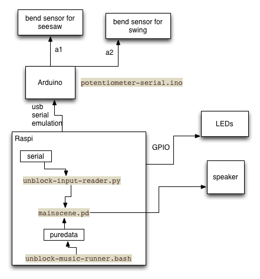

# Unblock

Unblock is the software for the "Block By Block" interactive exhibition.

## Stuff goes together like this

Two bend sensor attach to the analog inputs of the Tinyduino. These are read at 20hz and sent to the serial port at 19200bps as two ascii values separated by space and terminated with newline, by the `potentiometer-serial.ino` arduino script.

The Raspberry Pi runs a Python script `unblock-input-reader.py` which looks for all attached serial devices and starts reading from them. It opens the 'pdsend' tool to udp port 13000 and 13001, and when serial data comes in, it takes the two numbers and sends them to these two ports (note: only 13000 is implemented so far).

`unblock-music-runner.bash` just configures the sound card for analog output, and then starts the puredata script `mainscene.pd`. This scene starts the oscillator (i e turns on audio), and then starts listening on 13000 and 13001. It uses these two ports as inputs to mix together a pleasant background noise which is then outputted through the sound card.

(note: only horrible out-of-phase sine wave output is implemented. branch `mr/audio` starts building an accumulator value when there is activity on the swing, which can then be used as volume and/or pitch for playing the wav file that marisha is trying to get)

### LED lights

This hasn't been implemented yet. They will be controlled with the GPIO pins on the raspi. I'm thinking that puredata might be a nice way to control these as well. Maybe not, but visual flow programming feels like a nice way to control a flow-y structure like this one.

One cool effect would be if when the seesaw changes direction, its block lights up instantly and then fades out. this pulse is then propagated to the next block after a short delay, and then the next, and then the next, down the structure.

While idle, the structure could do a slow fade-in-fade-out of random colors, independently for each block.

## Install it like this

1. Install Raspbian
2. Binary dependencies: `sudo apt-get install puredata python-pip` (and probably more stuff)
3. Python dependencies: `sudo pip pyserial`
4. Clone it `git clone git@github.com:nevyn/unblock.git`
4. Make it start at boot: `sudo ln -s /home/pi/unblock/bootscript.sh /etc/init.d/unblock`
5. `sudo update-rc.d /etc/init.d/unblock defaults`

nevyn has an sd card with these things installed. he's going to try to clone it to a microsd.

